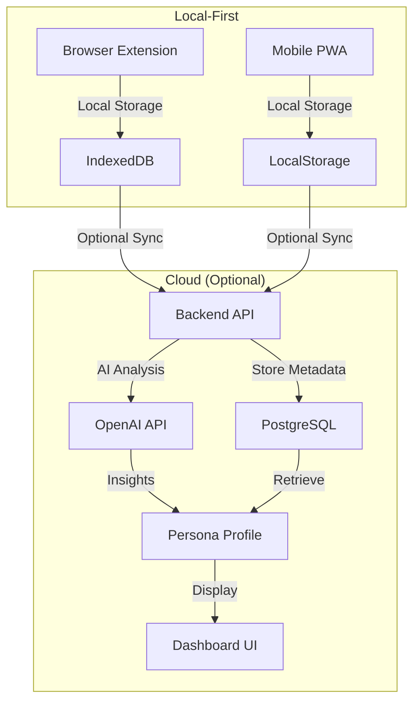
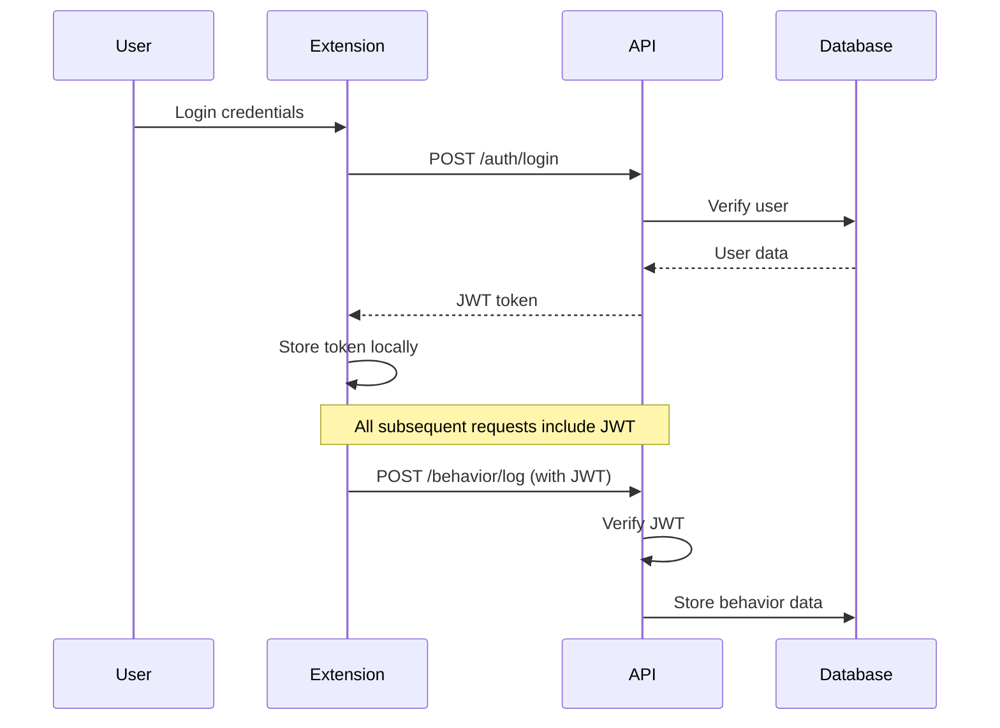

# 🏗️ MirrorMe Architecture

## 🎯 System Overview

MirrorMe is a privacy-first digital persona analysis platform consisting of:

1. **Browser Extension** - Captures browsing behavior locally
2. **Backend API** - Processes and analyzes behavior data
3. **Mobile PWA** - Extends tracking to mobile devices
4. **AI Engine** - Generates personality insights and summaries

## 🔄 Data Flow Architecture



## 🧩 Component Architecture

### 1. Browser Extension

**Technology Stack:**

- Manifest V3
- Vanilla JavaScript
- Chrome Extension APIs
- IndexedDB for local storage

**Key Components:**

```
extension/
├── manifest.json          # Extension configuration
├── background.js          # Service worker for tab tracking
├── content.js            # Page interaction capture
└── popup/
    ├── popup.html        # Extension UI
    ├── popup.css         # Styling
    └── popup.js          # UI logic and API communication
```

**Data Collection:**

- URL visits and time spent
- Search queries (Google, YouTube, Reddit)
- Page engagement metrics
- Click patterns on search results

**Privacy Features:**

- All raw data stored locally
- User controls what gets synced
- Sensitive data flagging
- One-click data deletion

### 2. Backend API

**Technology Stack:**

- FastAPI (Python)
- SQLAlchemy ORM
- PostgreSQL/SQLite
- JWT Authentication
- OpenAI API integration

**Architecture Layers:**

```
backend/
├── main.py              # FastAPI application
├── config.py            # Configuration management
├── database.py          # Database connection
├── models.py            # SQLAlchemy models
├── schemas.py           # Pydantic schemas
├── auth.py              # Authentication logic
├── ai_engine.py         # AI analysis engine
└── routers/
    ├── auth.py          # Authentication endpoints
    ├── behavior.py      # Behavior logging endpoints
    └── persona.py       # Persona analysis endpoints
```

**API Endpoints:**

| Endpoint              | Method | Purpose                   |
| --------------------- | ------ | ------------------------- |
| `/auth/register`      | POST   | User registration         |
| `/auth/login`         | POST   | User authentication       |
| `/auth/me`            | GET    | Get current user          |
| `/behavior/log`       | POST   | Log single behavior event |
| `/behavior/log-batch` | POST   | Log multiple events       |
| `/persona/analyze`    | POST   | Generate AI analysis      |
| `/persona/profile`    | GET    | Get persona profile       |
| `/persona/export`     | GET    | Export user data          |

### 3. Database Schema

**Core Tables:**

```sql
-- Users table
CREATE TABLE users (
    id SERIAL PRIMARY KEY,
    email VARCHAR UNIQUE NOT NULL,
    hashed_password VARCHAR NOT NULL,
    full_name VARCHAR,
    is_active BOOLEAN DEFAULT TRUE,
    created_at TIMESTAMP DEFAULT NOW(),
    updated_at TIMESTAMP
);

-- Persona profiles (AI-generated insights)
CREATE TABLE persona_profiles (
    id SERIAL PRIMARY KEY,
    user_id INTEGER REFERENCES users(id),
    top_topics JSON DEFAULT '[]',
    emotional_tone JSON DEFAULT '{}',
    interest_map JSON DEFAULT '{}',
    persona_summary TEXT,
    personality_traits JSON DEFAULT '[]',
    last_analysis TIMESTAMP,
    data_points_count INTEGER DEFAULT 0,
    created_at TIMESTAMP DEFAULT NOW(),
    updated_at TIMESTAMP
);

-- Behavior logs (metadata only, not raw data)
CREATE TABLE behavior_logs (
    id SERIAL PRIMARY KEY,
    user_id INTEGER REFERENCES users(id),
    source VARCHAR NOT NULL, -- 'extension' or 'mobile_app'
    behavior_type VARCHAR NOT NULL, -- 'search', 'visit', 'time_spent'
    category VARCHAR, -- 'technology', 'health', etc.
    keywords JSON DEFAULT '[]',
    sentiment VARCHAR, -- 'positive', 'neutral', 'negative'
    session_duration INTEGER, -- in seconds
    timestamp TIMESTAMP DEFAULT NOW(),
    is_sensitive BOOLEAN DEFAULT FALSE,
    include_in_analysis BOOLEAN DEFAULT TRUE
);
```

### 4. AI Analysis Engine

**Core Algorithm:**

```python
class PersonaAnalyzer:
    def analyze_user_persona(self, behavior_logs):
        # 1. Topic Extraction
        topics = self.extract_topics_from_keywords(keywords)

        # 2. Sentiment Analysis
        sentiment_dist = self.analyze_sentiment_distribution(logs)

        # 3. Interest Network Building
        interest_map = self.build_interest_network(topics)

        # 4. Personality Trait Extraction
        traits = self.extract_personality_traits(topics, sentiment, logs)

        # 5. AI Summary Generation (Optional)
        summary = self.generate_persona_summary(topics, sentiment)

        return {
            "persona_summary": summary,
            "top_topics": topics,
            "personality_traits": traits,
            "emotional_tone": sentiment_dist,
            "interest_map": interest_map
        }
```

**Analysis Features:**

- Topic categorization using keyword matching
- Sentiment distribution analysis
- Personality trait inference
- Interest network visualization
- Temporal behavior pattern detection

### 5. Mobile PWA (Future Enhancement)

**Technology Stack:**

- React + Vite
- Tailwind CSS
- PWA capabilities
- Service Workers

**Planned Features:**

- Mobile browsing tracking
- App usage monitoring (with permissions)
- Offline data collection
- Push notifications for insights

## 🔐 Security Architecture

### Authentication & Authorization



### Data Privacy

**Local-First Approach:**

1. All raw browsing data stays on device
2. Only processed metadata sent to server
3. User controls sync preferences
4. Granular privacy settings

**Data Minimization:**

- Keywords extracted, not full URLs
- Time spent, not exact timestamps
- Categories, not specific sites
- Sentiment, not content

### GDPR Compliance

- **Right to Access**: Full data export functionality
- **Right to Rectification**: User can edit/flag data
- **Right to Erasure**: One-click data deletion
- **Data Portability**: JSON export format
- **Consent Management**: Granular opt-in controls

## 📊 Performance Architecture

### Scalability Considerations

**Database Optimization:**

```sql
-- Indexes for common queries
CREATE INDEX idx_behavior_logs_user_timestamp ON behavior_logs(user_id, timestamp);
CREATE INDEX idx_behavior_logs_category ON behavior_logs(category);
CREATE INDEX idx_persona_profiles_user ON persona_profiles(user_id);

-- Partitioning for large datasets
CREATE TABLE behavior_logs_2024 PARTITION OF behavior_logs
FOR VALUES FROM ('2024-01-01') TO ('2025-01-01');
```

**Caching Strategy:**

- Redis for session storage
- CDN for static assets
- Application-level caching for persona profiles

**API Rate Limiting:**

```python
from slowapi import Limiter
from slowapi.util import get_remote_address

limiter = Limiter(key_func=get_remote_address)

@app.post("/behavior/log")
@limiter.limit("100/minute")
async def log_behavior(request: Request, ...):
    # Rate limited endpoint
```

### Extension Performance

**Efficient Data Collection:**

- Debounced event handlers
- Batch API calls every 5 minutes
- Local storage with size limits
- Background processing

**Memory Management:**

- Circular buffer for behavior logs
- Periodic cleanup of old data
- Lazy loading of UI components

## 🔄 Integration Architecture

### Third-Party Services

**OpenAI Integration:**

```python
async def generate_persona_summary(self, context):
    try:
        response = await openai.ChatCompletion.acreate(
            model="gpt-3.5-turbo",
            messages=[
                {"role": "system", "content": "You are a digital behavior analyst..."},
                {"role": "user", "content": f"Analyze this behavior: {context}"}
            ],
            max_tokens=150,
            temperature=0.7
        )
        return response.choices[0].message.content
    except Exception as e:
        # Fallback to rule-based summary
        return self.generate_fallback_summary(context)
```

**Analytics Integration:**

- Google Analytics for usage metrics
- Sentry for error tracking
- Custom metrics for persona insights

### Extension Store Distribution

**Chrome Web Store:**

- Automated builds via GitHub Actions
- Version management
- User feedback integration

**Enterprise Distribution:**

- Self-hosted extension packages
- Custom update servers
- Group policy deployment

## 🧪 Testing Architecture

### Backend Testing

```python
# pytest configuration
def test_persona_analysis():
    # Create test user and behavior data
    user = create_test_user()
    behaviors = create_test_behaviors(user.id)

    # Run analysis
    result = persona_analyzer.analyze_user_persona(db, user.id)

    # Verify results
    assert result["data_points_analyzed"] > 0
    assert len(result["top_topics"]) > 0
    assert result["persona_summary"] is not None
```

### Extension Testing

**Unit Tests:**

- Background script functionality
- Content script data extraction
- Popup UI interactions

**Integration Tests:**

- API communication
- Data sync workflows
- Authentication flows

**E2E Tests:**

```javascript
// Puppeteer test example
const puppeteer = require("puppeteer");

test("Extension captures search behavior", async () => {
  const browser = await puppeteer.launch({
    headless: false,
    args: ["--load-extension=./extension"],
  });

  const page = await browser.newPage();
  await page.goto("https://google.com");
  await page.type('input[name="q"]', "test search");
  await page.press('input[name="q"]', "Enter");

  // Verify behavior was captured
  const behaviorData = await page.evaluate(() => {
    return chrome.storage.local.get(["behaviorData"]);
  });

  expect(behaviorData.behaviorData).toContainEqual(
    expect.objectContaining({
      behavior_type: "search",
      keywords: expect.arrayContaining(["test", "search"]),
    })
  );
});
```

## 🚀 Deployment Architecture

### Development Environment

```yaml
# docker-compose.yml
version: "3.8"
services:
  backend:
    build: ./backend
    ports:
      - "8000:8000"
    environment:
      - DATABASE_URL=postgresql://user:pass@db:5432/mirrorme
    depends_on:
      - db

  db:
    image: postgres:13
    environment:
      - POSTGRES_DB=mirrorme
      - POSTGRES_USER=user
      - POSTGRES_PASSWORD=pass
    volumes:
      - postgres_data:/var/lib/postgresql/data

volumes:
  postgres_data:
```

### Production Deployment

**Infrastructure as Code:**

```terraform
# Fly.io deployment
resource "fly_app" "mirrorme_api" {
  name = "mirrorme-api"
  org  = "mirrorme"
}

resource "fly_machine" "api" {
  app    = fly_app.mirrorme_api.name
  region = "ord"
  name   = "mirrorme-api-machine"

  image = "mirrorme/api:latest"

  env = {
    ENVIRONMENT = "production"
  }

  services = [
    {
      ports = [
        {
          port     = 443
          handlers = ["tls", "http"]
        },
        {
          port     = 80
          handlers = ["http"]
        }
      ]
      protocol      = "tcp"
      internal_port = 8000
    }
  ]
}
```

### Monitoring & Observability

**Application Metrics:**

- Request latency and throughput
- Error rates and types
- User engagement metrics
- Persona analysis success rates

**Infrastructure Metrics:**

- CPU and memory usage
- Database performance
- Network latency
- Storage utilization

**Alerting:**

```yaml
# Example alert configuration
alerts:
  - name: "High Error Rate"
    condition: "error_rate > 5%"
    duration: "5m"
    action: "notify_team"

  - name: "Database Connection Issues"
    condition: "db_connections_failed > 10"
    duration: "2m"
    action: "page_oncall"
```

---

This architecture provides a solid foundation for a privacy-first, scalable digital persona analysis platform while maintaining user control and data security.
